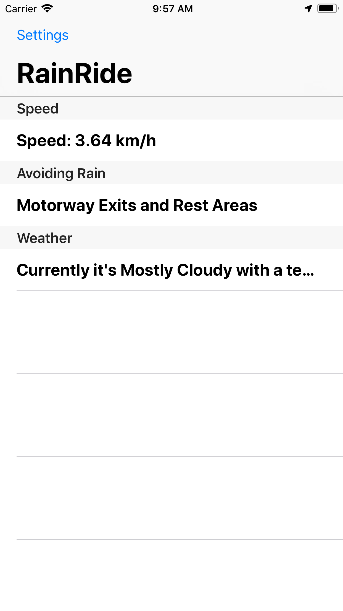
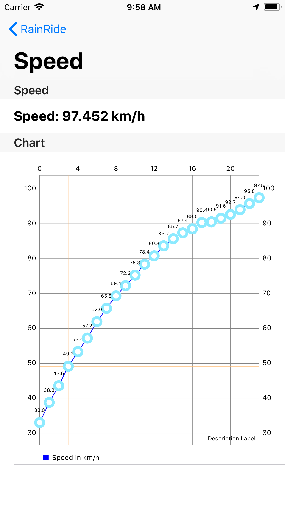
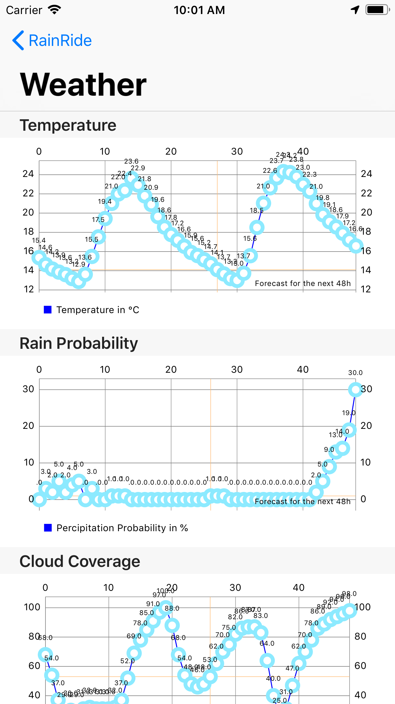
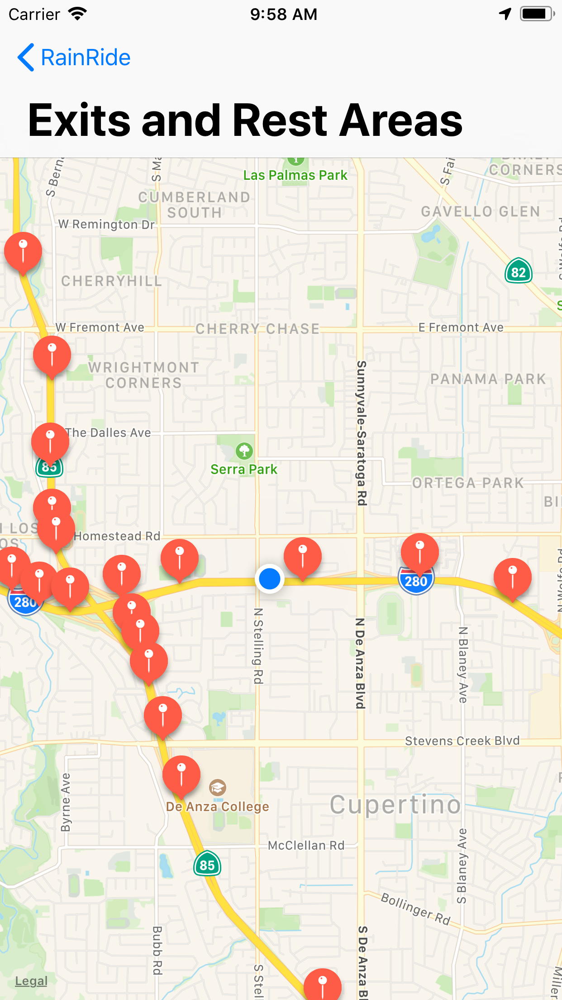

# rainride

  :umbrella: **never get wet again** :umbrella:   
  a project by bastian "phntxx" meissner

 

## Philosophy / Motivation

Imagine you're driving down the motorway in your open-top convertible or your motorcycle. In the distance you see the clouds getting denser and grayer. Instead of dealing with the risk of getting soaked by rain, check if it is actually going to rain and when you can exit the motorway to find a place to close your roof or wait out the rain.

## Features

- :car: Speed in real-time
- :sunny: Information on current temperature, sky cloud coverage and rain probability from your current location
- :station: Closest motorway exits and rest areas displayed on a map
- :chart_with_upwards_trend: Graphs for your speed and weather information

## Screenshots

  
  
  
  

---

## Credits

[Weather information powered by DarkSky](http://darksky.net/poweredby)   
[Charts powered by danielgindi/Charts](https://github.com/danielgindi/Charts)   
[Motorway exit / rest area information powered by OSM / Overpass](https://www.overpass-api.de)
